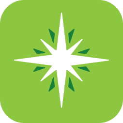
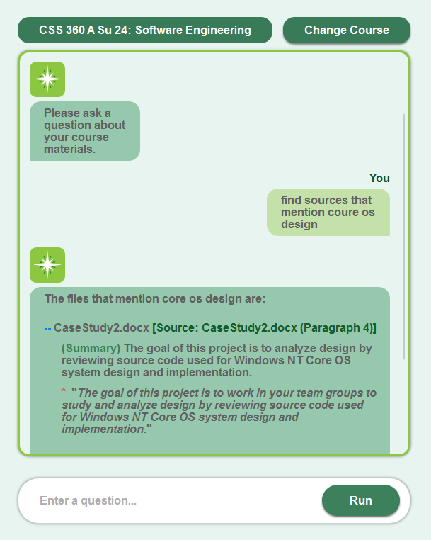
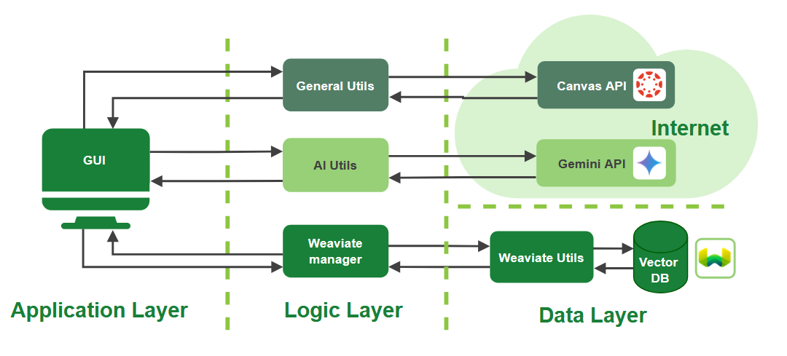
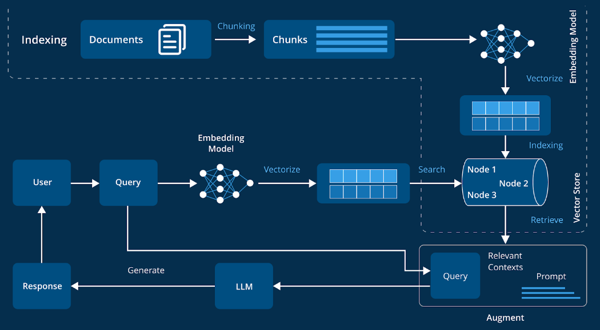

<a id="readme-top"></a>
<div align="center">


</div>

<br />
<br />

<br />
<div align="center">
  <a href="https://github.com/iliyabel">
    
  </a>

<h3 align="center">Course Compass<br>A Canvas Assistant</h3>

  <p align="center">
    AI-powered course assistant that runs locally. Upload course files, ask questions, and get answers through a chatbot interface.
    <br />
    <a href="https://github.com/Iliyabel/SmartCanvasSearch"><strong>Explore the docs »</strong></a>
    <br />
    <br />
  </p>
</div>

## Overview



Course Compass is a locally run Python RAG application designed to enhance your learning experience by enabling you to search through your Canvas course files using natural language queries. It leverages natural language processing (NLP) techniques, including semantic text chunking, embedding generation, and hybrid search, to provide accurate and relevant search results.

This application is intended for local use, allowing you to process and search your Canvas files without relying on external cloud services for core functionality.


## Table of Contents
* [Features](#features)
* [Technologies Used](#technologies-used)
* [Project Structure](#project-structure)
* [Installation](#installation)
* [Configuration](#configuration)
* [Usage](#usage)
* [Troubleshooting](#troubleshooting)

## Features

*   **Graphical User Interface:** Built with PyQt6, providing screens for API token input course selection, and an interactive chat interface for querying.
*   **Canvas Integration:**
    *   Retrieves a list of your courses from Canvas.
    *   Downloads specified course materials (PDF, DOCX, PPTX, TXT) using the Canvas API.
    *   Securely saves your Canvas API token locally after initial input.
*   **File Processing:**
    *   Extracts text content from various file formats.
    *   Performs semantic chunking on extracted text to create meaningful segments.
*   **Vector Search & Indexing:**
    *   Generates embeddings for text chunks using Sentence Transformers.
    *   Stores and indexes course metadata, file metadata, and text chunks (with vectors) in a local Weaviate vector database.
    *   Supports hybrid search (keyword + vector) for retrieving relevant chunks.
*   **AI-Powered Question Answering:**
    *   Uses Google's Gemini AI to generate answers based on the context retrieved from your course documents.
    *   Formats AI responses for better readability in the chat interface.
*   **Local Weaviate Management:**
    *   Automates Weaviate startup using Docker Compose.
    *   Manages schema creation and data ingestion into Weaviate.
*   **Efficient Data Handling:**
    *   Checks for existing data in Weaviate to avoid redundant processing and chunking.
    *   Uses threading for background tasks (Weaviate initialization, file downloads, AI queries) to keep the GUI responsive.


## Technologies Used

*   **Python 3.x**
*   **GUI:**
    *   PyQt6
*   **NLP & Embeddings:**
    *   Sentence Transformers (`sentence-transformers` for `all-MiniLM-L6-v2` model)
    *   NLTK (for sentence tokenization - `punkt`)
*   **Vector Database:**
    *   Weaviate (run via Docker)
    *   `weaviate-client` (Python library)
*   **AI Integration:**
    *   Google Generative AI SDK (`google-generativeai` for Gemini API)
*   **Canvas API Interaction:**
    *   `requests`
*   **File Parsing:**
    *   `PyPDF2` (via `pdfminer.six` which is used by `extractTextFromPdf`)
    *   `python-docx`
    *   `python-pptx`
    *   Standard library for TXT files
*   **Environment & Configuration:**
    *   `python-dotenv` (for managing `.env` files)
*   **Containerization:**
    *   Docker & Docker Compose (for Weaviate service)

## Project Structure
```
SmartCanvasSearch/
├── Courses/                  # Downloaded course files (organized by course ID)
├── gui/
│   ├── app.py                # Main PyQt6 application, UI logic, screen definitions
│   └── __init__.py
├── resources/
│   ├── ClassList.json        # Cached list of user's Canvas courses
│   ├── canvas_token.txt      # Saved Canvas API token (after first input)
│   ├── styles.css            # Stylesheet for the GUI
│   └── icon.png              # Application icon
├── utils/
│   ├── ai_utils.py           # Gemini AI interaction and response formatting
│   ├── general_utils.py      # Canvas API calls, file downloading, text extraction, chunking
│   ├── weaviate_manager.py   # Manages Weaviate service (Docker) and high-level DB operations
│   ├── weaviate_utils.py     # Low-level Weaviate client interaction, schema, search
│   └── __init__.py
├── .env                      # Environment variables (BASE_URL, GEMINI_API_KEY) - user created
├── docker-compose.yml        # Docker configuration for Weaviate
├── main.py                   # Application entry point
├── requirements.txt          # Python dependencies
└── README.md                 # This file
```

### Architecture



### RAG Data Flow




## Installation

1.  **Prerequisites:**
    *   Python 3.9+
    *   Docker Desktop (or Docker Engine with Docker Compose) installed and running.

2.  **Clone the Repository:**
    ```bash
    git clone [your_repository_url]
    cd SmartCanvasSearch
    ```

3.  **Create and Activate a Virtual Environment (Recommended):**
    ```bash
    python -m venv venv
    ```
    *   On Windows: `venv\Scripts\activate`
    *   On macOS/Linux: `source venv/bin/activate`

4.  **Install Python Dependencies:**
    ```bash
    pip install -r requirements.txt
    ```

## Configuration

1.  **Create a `.env` file** in the project root (`SmartCanvasSearch/`) with the following content:
    ```env
    # .env
    BASE_URL=https://your_canvas_instance.instructure.com/api/v1/
    GEMINI_API_KEY=your_google_gemini_api_key
    ```
    *   Replace `https://your_canvas_instance.instructure.com/api/v1/` with the API base URL for your Canvas instance.
    *   Replace `your_google_gemini_api_key` with your actual API key from Google AI Studio.

2.  **Canvas Access Token:** You will be prompted to enter your Canvas Access Token when you first run the application.
    *   **How to get your Canvas Access Token:**
        1.  Log in to your Canvas account.
        2.  Go to **Account** (usually in the left sidebar).
        3.  Click on **Settings**.
        4.  Scroll down to the **Approved Integrations** section.
        5.  Click on **+ New Access Token**.
        6.  For **Purpose**, you can enter something like "Course Compass App".
        7.  Leave **Expires** blank for no expiration, or set a date.
        8.  Click **Generate Token**.
        9.  **Important:** Copy the generated token immediately. You won't be able to see it again.
    *   The application will save this token to `resources/canvas_token.txt` for future sessions.

## Usage

1.  **Start Weaviate (Optional - the app attempts to start it):**
    If Docker is running, the application will attempt to start the Weaviate service using the `docker-compose.yml` file. Alternatively, you can manually start it from the project root:
    ```bash
    docker compose up -d
    ```
    Wait for Weaviate to be ready.

2.  **Run the Application:**
    Navigate to the project root directory in your terminal (where `main.py` is located) and run:
    ```bash
    python main.py
    ```

3.  **First-Time Setup (Welcome Screen):**
    *   If it's your first time or the token is not found, you'll see the Welcome Screen.
    *   Enter your Canvas Access Token and click "Continue with Token".
    *   The application will then fetch your course list.

4.  **Course Selection Screen:**
    *   Select a course you want to query.
    *   The application will download the course files (if not already downloaded) and ingest them into Weaviate. This might take some time for courses with many files. Status updates will be shown in the status bar.

5.  **Chat Screen:**
    *   Once a course is processed, you'll be taken to the chat screen.
    *   Type your questions about the course materials in the input field and press Enter or click "Send".
    *   The application will search the relevant documents and use Gemini AI to provide an answer with source citations.

## Troubleshooting

*   **Docker/Weaviate Issues:**
    *   Ensure Docker Desktop is running.
    *   If Weaviate fails to start, check Docker logs: `docker compose logs weaviate`
    *   Ensure port `8080` (for HTTP) and `50051` (for gRPC) are not blocked by another application or firewall.
*   **Canvas API Errors:**
    *   Verify your `BASE_URL` in the `.env` file is correct.
    *   Ensure your Canvas Access Token is valid and has not expired. You might need to delete `resources/canvas_token.txt` and re-enter it via the GUI.
*   **Gemini API Errors:**
    *   Verify your `GEMINI_API_KEY` in the `.env` file is correct.
    *   Check your Google AI Studio dashboard for API usage and potential issues.
*   **"Stylesheet not found"**: Ensure `resources/styles.css` exists in the project structure.
*   **"NLTK 'punkt' tokenizer not found"**: Run `python -m nltk.downloader punkt` if the automatic download fails.